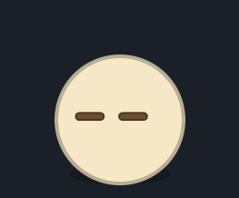
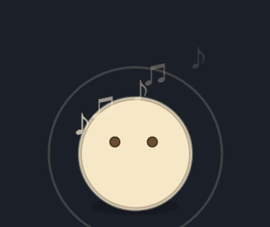

# 团团 · 桌面宠物 (Round-table-pet)

[](https://www.electronjs.org/)
[](https://www.microsoft.com/windows)
[](LICENSE)
[](https://github.com/StrangeHamburger/Round-table-pet/releases)

一颗会呼吸、会互动、还会跟着音乐摆动的大圆球——基于 Electron 的 Windows 桌面宠物「团团」。

## 功能演示

| 待机（会眨眼、呼吸、打哈欠） | 音乐播放时跟着节奏跳舞 |
|---|---|
|  |  |

## ✨ 特性

- **透明无边框**：始终置顶，不占任务栏，不挡操作
- **🖱️ 鼠标穿透 + 悬停检测**：平时不挡操作，靠近时才互动
- **互动玩法**：
  - 单击跳一下、连续戳 3 下会晕眩、双击追着你跑
  - 按住拖动可以把它甩飞
  - 鼠标在它身上来回划 = 抚摸
- **🏠 定家 / 回家**：拖到喜欢的位置点「定家」，点「回家」它会自己爬回去
- **🎭 待机自主行动**：打哈欠、伸懒腰、打喷嚏、打滚、躲猫猫、走两步
- **🎵 音乐感知**：读取 Windows 当前媒体播放状态，播放音乐时切换表情、飘音符、随节拍跳舞
- **⌨️ 打字感知**：检测键盘输入，边打字它边跟着蹦跶
- **⚙️ 右键设置菜单**：定家 / 回家、调整大小、切换配色、退出
- **🔒 单实例运行**：重复启动只会聚焦已有窗口

## 📋 环境要求

- Windows 10 / 11
- Node.js 18+ 和 npm

## 🚀 快速开始

```powershell
git clone https://github.com/StrangeHamburger/Round-table-pet.git
cd Round-table-pet
npm install
npm start
```

也可以直接在本地目录运行：

```powershell
cd C:\Users\hbg20\桌宠
npm install
npm start
```

## 🕹️ 操作说明

| 操作 | 效果 |
| --- | --- |
| 单击 | 跳一下 |
| 连续戳 3 下 | 晕眩 |
| 双击 | 追着你跑 |
| 按住并拖动 | 甩飞 |
| 鼠标来回划 | 抚摸 |
| 右键 | 打开设置菜单 |
| `Esc` | 关闭设置菜单 |
| 设置菜单里的「退出」 | 结束程序 |

## 📜 常用脚本

| 命令 | 说明 |
| --- | --- |
| `npm start` | 启动桌宠 |
| `powershell -ExecutionPolicy Bypass -File .\create-shortcut.ps1` | 在桌面创建「团团」快捷方式 |
| `node make-icon.js` | 生成图标文件 |

> 快捷方式脚本默认使用 `C:\Users\hbg20\桌宠` 路径；如果项目移动了位置，请先修改 `create-shortcut.ps1` 中的路径。

## 🛠️ 技术栈

- **Electron 33**（透明无边框置顶窗口 + 鼠标穿透）
- **原生 HTML / Canvas / JavaScript**（无任何前端框架，全部手绘动画）
- **PowerShell 桥接** Windows GSMTC 媒体信息与键盘状态

```
main.js          主进程（窗口 / 单实例 / 光标轮询）
├── music.ps1    音乐桥接（GSMTC 播放状态）
└── keyboard.ps1 键盘桥接（打字检测）
index.html       渲染进程（Canvas 动画 + 设置菜单）
create-shortcut.ps1   桌面快捷方式
make-icon.js          图标生成
```

## 🎨 交互设计

- 5 套配色（奶油 / 米白 / 蜜桃 / 薄荷 / 雾蓝），右键菜单一键切换
- 心情系统：正常 / 开心 / 难过 / 惊讶 / 犯困 / 睡觉 / 晕眩，互动触发
- 行为系统：发呆 / 打哈欠 / 伸懒腰 / 打喷嚏 / 打滚 / 躲猫猫 / 走路，随机自主执行
- 兴奋度机制：互动越多动作越频繁，越玩越有生命力

## 📄 License

[MIT](LICENSE)